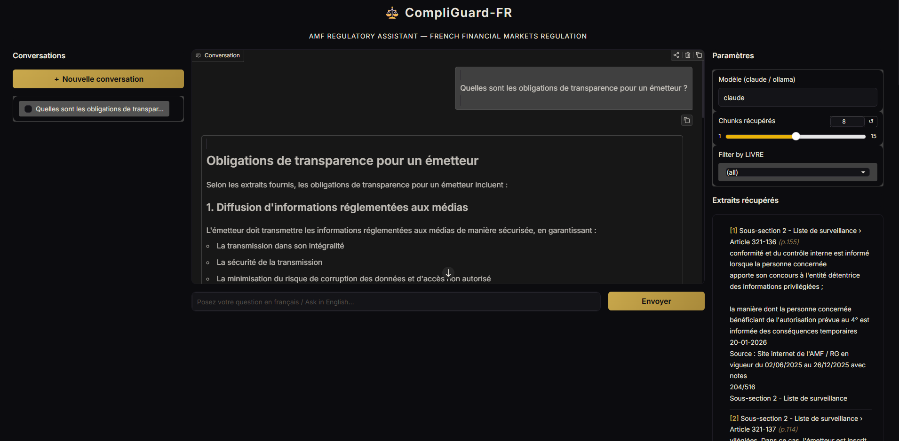

# CompliGuard-FR

A RAG (Retrieval Augmented Generation) assistant for the **AMF Règlement Général**, the core regulatory text of the *Autorité des marchés financiers* (French financial markets authority).

Ask questions in **French or English** and get answers grounded strictly in the regulatory text, with cited article references.


## Architecture

```
INGESTION
──────────────────────────────────────────────────────
  PDF  →  Extract  →  Segment by Article  →  Chunk
          (PyMuPDF)   (LIVRE/TITRE/        (1200 chars,
                       CHAPITRE/Section)    paragraph-aware)
                                  ↓
                             Embed  →  FAISS Index
                          (multilingual)

QUERY
──────────────────────────────────────────────────────
  Question  →  Embed  →  FAISS Search  →  Top-K Chunks
                                               ↓
                                    LLM (Claude / Ollama)
                                               ↓
                                    Answer + Citations

INTERFACES
──────────────────────────────────────────────────────
  Gradio UI                    REST API
```


## Setup

**1. Install dependencies**

```bash
pip install -r requirements.txt
```

**2. Configure your API key**

```bash
cp .env.example .env
# edit .env and set ANTHROPIC_API_KEY
```

**3. Add regulatory PDFs**

Place AMF PDF files in the `data/` directory

**4. Run the ingestion pipeline**

```bash
python ingest.py
```

This extracts text, segments by article, embeds with a multilingual model, and builds a FAISS index in `vector_store/`

---

## Usage

### Gradio UI

```bash
python ui.py
```



Full-featured interface with conversation history sidebar, source excerpts panel, and LIVRE filter

### REST API

```bash
uvicorn api:app --reload
```

`POST /ask`

```json
{
  "question": "Quelles sont les obligations de transparence pour un émetteur ?",
  "model": "claude",
  "top_k": 8,
  "livre": "LIVRE II"
}
```

### CLI

```bash
# Interactive chat
python llm.py

# Single retrieval query
python query.py "Article 111-1" --top-k 5
```

---

## Models

| Backend | How to use | Notes |
|---|---|---|
| **Claude** (default) | Set `ANTHROPIC_API_KEY` in `.env` | Best quality |
| **Ollama** | Run `ollama pull mistral` locally | Offline fallback |
